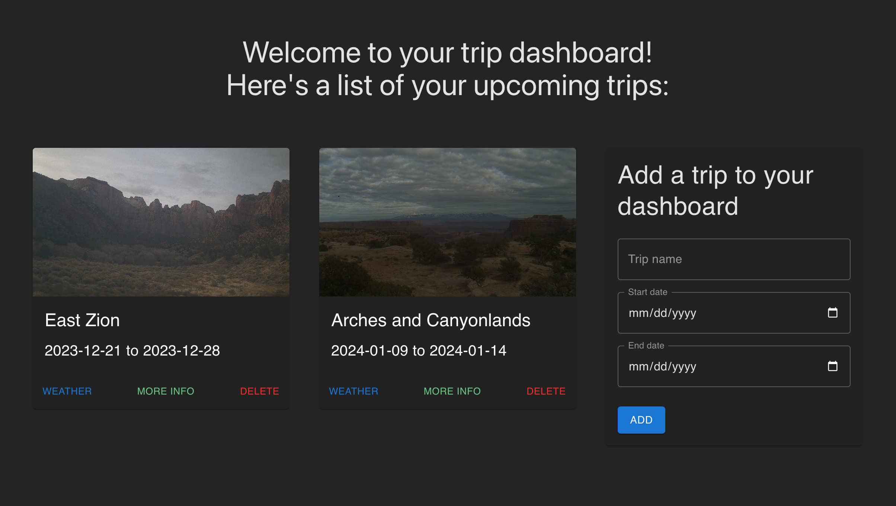
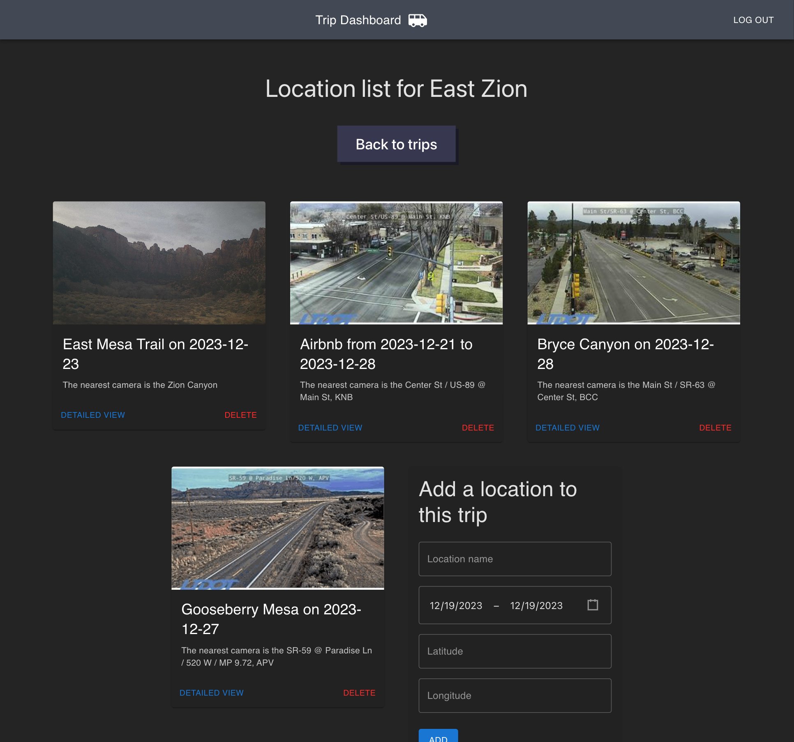
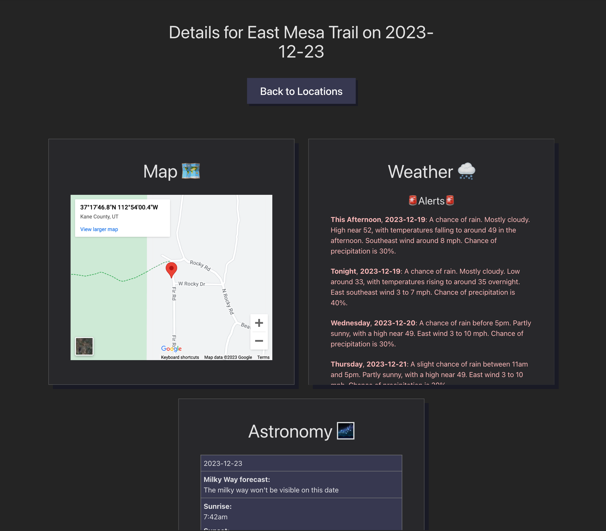

# Road Trip Dashboard

Road trips are a lot of fun, but they can be unpredictable. In Utah, you never know what kind of weather you're going to run into in the desert — especially if you're covering a large distance by car or van (Utah has 15 unique [Köppen Climate Types](https://en.wikipedia.org/wiki/K%C3%B6ppen_climate_classification) ranging from hot desert to humid subtropical to subarctic to tundra!).

  
  
  

This app aims to make your trips more predictable by displaying an entire dashboard with live data about the weather on your upcoming trip as well as live video from some of the hundreds of [road cameras operated by the Utah Department of Transportation](https://udottraffic.utah.gov/map).

## Trip View
At the top level of the app, you'll see a grid with all your upcoming trips; from here, you can hover over the "WEATHER" button and get a quick report on whether any locations for this trip have rain or snow forecasted prior to the date you'll be visiting.

## Location View
Clicking the "MORE INFO" button brings you to a view of all the locations you have saved for a trip. Each location requires a set of coordinates, which are used to find the closest camera in UDOT's database and to fetch the weather and astronomy data.

## Detailed Location View
For each location, you can view a detailed weather and astronomy forecast that'll alert you of any inclement weather and let you know what the best star-viewing windows will be for each night you'll be spending at the location.

## Future Features:
- [ ] let user choose a location on a map when submitting the new trip form (as an alternative to entering an exact latitude and longitude)
- [ ] display weather alerts related to the routes between trip locations